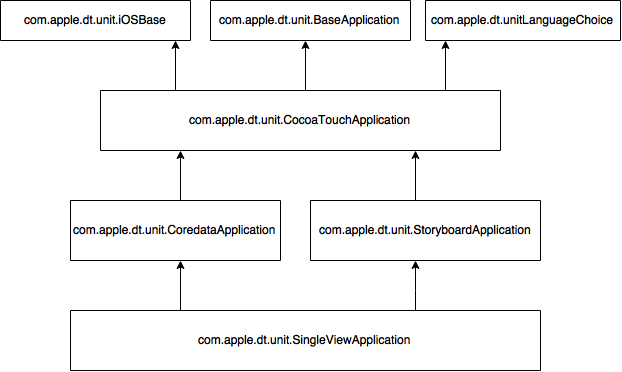

# Create custom project templates in Xcode

### There are the build-in Mac OS project templates below:
```
/Applications/Xcode.app/Contents/Developer/Library/Xcode/Templates/Project Templates/Mac
```

### This folder is the build-in iOS project templates:
```
/Applications/Xcode.app/Contents/Developer/Platforms/iPhoneOS.platform/Developer/Library/Xcode/Templates/Project Templates/iOS
```

### Adding your own templates by placing them in the folder:
```
~/Library/Developer/Xcode/Templates
```
#### Create your own first iOS project template:

1. Creating a *Templates* folder under `~/Library/Developer/Xcode` if it doesn't exist.
2. Creating a *Custom* folder under `~/Library/Developer/Xcode/Templates`
3. Copying the *Single View Application.xctemplate* in `~/Library/Developer/Xcode/Templates/Custom`
> the Single View Application.xctemplate is under `/Applications/Xcode.app/Contents/Developer/Platforms/iPhoneOS.platform/Developer/Library/Xcode/Templates/Project Templates/iOS`
4. Opening *TemplateInfo.plist* file under folder of Custom folder. 
5. Changing the value of `Identifier` in .plist into for example `com.cshan.dt.unit.hanchenApplication`

Open Xcode and go to the new project panel, you should be able to see your custom category with the project template in it.

---

## See each TemplateInfo.plist file under .xctemplate 

### Kind
> Xcode Template Kind. Project or File.

### Identifier
> Every template has an identifier key which consist of a prefix and the name of the template.

> Apple uses a `com.apple.dt.unit` prefix, so every template provided by them has it.

### Ancestors
> Import settings from another Project Template.
  The Ancestore key defines the parents of the current template.

`com.apple.dt.unit.storyboardApplication` - adds the UIMainStoryboardFile key to the Info.plist file.

`com.apple.dt.unit.coreDataCocoaTouchApplication` - adds the Core Data boilerplate to the app delegate if you select the checkbox

The *storyboard* and *core data* templates these identifiers reference both inherit from a *Cocoa Touch Application Base template*:
`com.apple.dt.unit.cocoaTouchApplicationBase` - adds unit test options, the application delegate boilerplate code and some Info.plist settings.

This template inherits from a number of others including an iOS App Base template to build a complex setup that takes some unpicking.



### Concrete
> Must be `YES` for Xcode to show the template. If missing Xcode treats the template as an abstract base template that other templates will inherit from.

### Description
> Xcode 9 does not seem to show it.

### SortOrder
> Set to override the default alphabetical sort order in the template browser.

### Nodes
> An array of items to create in the new project. These can be code snippets, project and build settings or whole files. The value of each item is often an identifier to a definition stored in the Definitions section of this template or an inherited template.

### Definitions
> A dictionary of definitions for the items in Nodes. You can override a defintion from a previous template. You can include an external file using a path dictionary.

### Options
> New Project Wizard >> Choose Options for Project. Add Text Fields, Combo Boxes.

### Project
> Set Project Build Settings.

### Targets
> Set Build Settings, Build Phases for Targets. Link Libraries.

--- 

## Source:
http://www.telerik.com/blogs/how-to-create-custom-project-templates-in-xcode-7
https://useyourloaf.com/blog/creating-custom-xcode-project-templates/